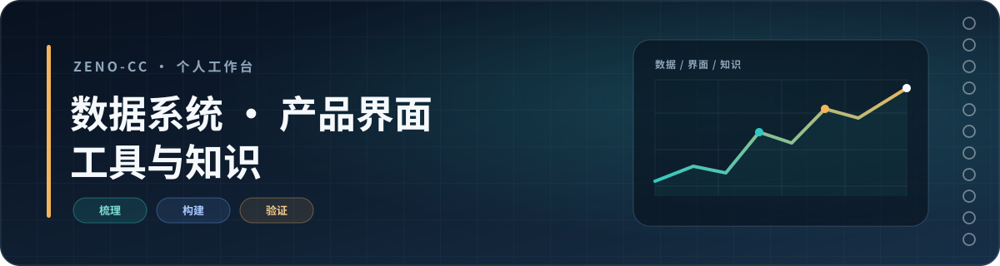

  

  <a href="https://github.com/Zeno-cc/FilmFrame">selected work</a>
  ·
  <a href="https://filmframemaker.vercel.app">live demo</a>
  ·
  <a href="https://github.com/Zeno-cc?tab=repositories">all repositories</a>

# Zachary Xu / `Zeno-cc`

I build small systems around messy data: BI dashboards, Django/React interfaces,
and SQL/Python automation. I also keep a knowledge base in Obsidian and use AI
to explore, implement, review, and verify faster.

`BI systems` · `Django` · `React` · `SQL` · `Python` · `TypeScript` · `Obsidian`

> 我更在意一条链路能不能被解释、复用和验证，而不是只在演示里看起来很快。

## What I build

- **Data workflows** — dashboards and maintenance flows that keep dates, states,
  and impact visible.
- **Product interfaces** — practical Django/React tools for work that has to be
  checked by more than one person.
- **Automation & notes** — SQL/Python reporting workflows, reusable scripts,
  and an Obsidian knowledge base for decisions that should not disappear after
  the first successful run.

## Selected work

### [FilmFrame](https://github.com/Zeno-cc/FilmFrame)

A browser-based digital darkroom for arranging photos into contact sheets and
35mm film frames. It processes photos locally in the browser and exports single
frames or continuous strips.

[Repository](https://github.com/Zeno-cc/FilmFrame) ·
[Try the live demo](https://filmframemaker.vercel.app)

### [Easy_Todo](https://github.com/Zeno-cc/Easy_Todo)

A small macOS menu-bar todo app with keyboard shortcuts, sorting, completion
management, and dark-mode support.

[Repository](https://github.com/Zeno-cc/Easy_Todo)

## Working principles

- Start with the data boundary before choosing the chart or component.
- Make assumptions, states, and failure paths visible.
- Prefer a result that can be reproduced and explained over a clever shortcut.
- Let AI accelerate exploration and implementation; keep validation and
  judgment human-readable.

## Current focus

- Making BI maintenance and insight workflows easier to inspect.
- Building local-first tools with clear privacy and data boundaries.
- Turning useful decisions into notes, so the next change starts with context.

  广东 · 东莞理工学院 · 继续把事情做清楚。

