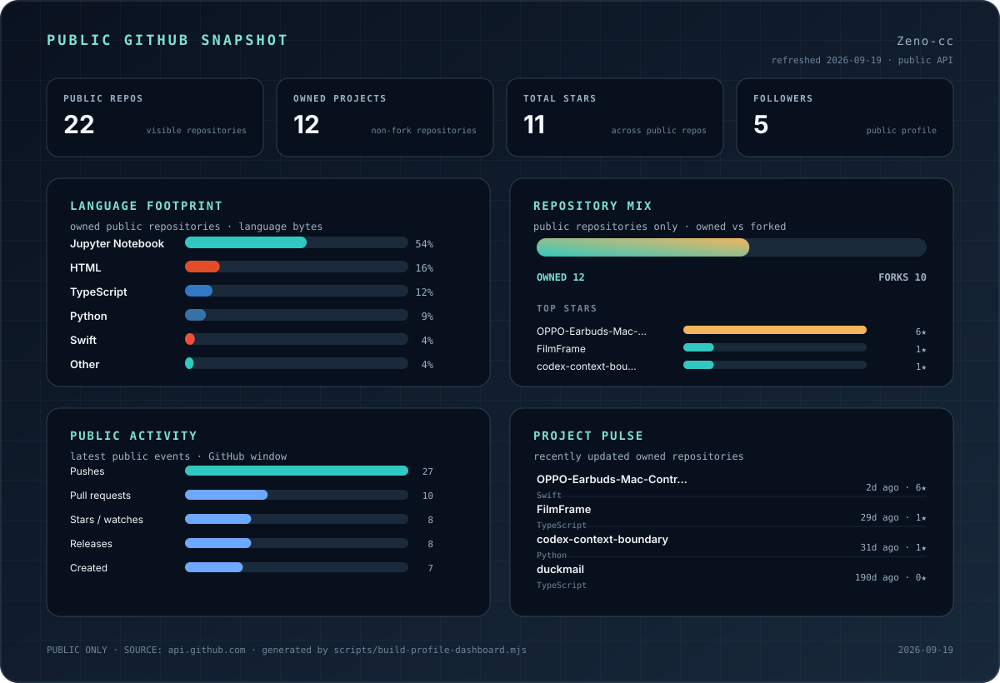

  

  <strong>把复杂的数据和工作流，整理成可解释、可复用、可验证的系统。</strong>

  数据系统 · macOS 工具 · 本地优先 · AI 协作开发

  <a href="#代表作品">代表作品</a>
  ·
  <a href="#公开数据概览">公开数据概览</a>
  ·
  <a href="https://github.com/Zeno-cc?tab=repositories">全部仓库</a>

## 你好，我是 Zeno-cc

我喜欢把真实工作里那些容易混乱、反复确认、靠经验记住的东西，做成更清楚的系统和工具。

目前主要在做数据分析与可视化、Django / React 应用、macOS 工具，以及 SQL / Python 自动化。我也会用 AI 参与需求探索、实现、审查和验证，但更在意最后的业务边界、失败路径和验收标准能不能被人读懂。

**常用技术：** TypeScript · React · Python · Django · Swift · SQL · Docker · GitHub Actions

## 代表作品

### [OPPO 耳机 Mac 控制器](https://github.com/Zeno-cc/OPPO-Earbuds-Mac-Controller)

面向 OPPO 耳机的 macOS 菜单栏工具。可以查看耳机电量、切换降噪 / 通透、调整降噪强度、均衡器和低延迟模式，并尽量让 Mac 端体验接近原生设备控制。

[查看仓库](https://github.com/Zeno-cc/OPPO-Earbuds-Mac-Controller) · [前往下载](https://github.com/Zeno-cc/OPPO-Earbuds-Mac-Controller/releases)

### [FilmFrame](https://github.com/Zeno-cc/FilmFrame)

一间运行在浏览器里的数字暗房。照片在本地完成裁切、渲染和导出，可以生成 35mm 胶片边框、接触印样和连续胶片长条，不把照片上传到服务端。

[查看仓库](https://github.com/Zeno-cc/FilmFrame) · [在线体验](https://filmframemaker.vercel.app)

### [Codex Context Boundary](https://github.com/Zeno-cc/codex-context-boundary)

面向 Codex / opencodex 的上下文边界修复方案，处理模型或供应商切换后，加密推理状态、上下文压缩和子代理任务无法继续的问题。

[查看仓库](https://github.com/Zeno-cc/codex-context-boundary)

## 我怎么做项目

- **先讲清数据边界。** 在决定图表、组件和技术实现之前，先确认数据从哪里来、代表什么。
- **把状态和失败路径做出来。** “正常时能跑”只是起点，异常、回退、恢复同样是产品的一部分。
- **优先可复现和可解释。** 比起一次性的聪明捷径，我更喜欢下一次还能验证、还能继续改的方案。
- **让 AI 加速，但不让上下文消失。** 需求、约束、验证结果和重要决策尽量沉淀成可读的文档和测试。

## 公开数据概览

  

  仅统计公开数据 · 每日通过 GitHub 公开接口自动更新

## 最近关注

- 让数据分析系统更容易维护、追溯和解释。
- 做真正会长期使用的小工具，而不是只停留在演示阶段。
- 探索 AI 参与软件工程后，怎样把上下文、测试和工程纪律保留下来。

  继续把事情做清楚。

